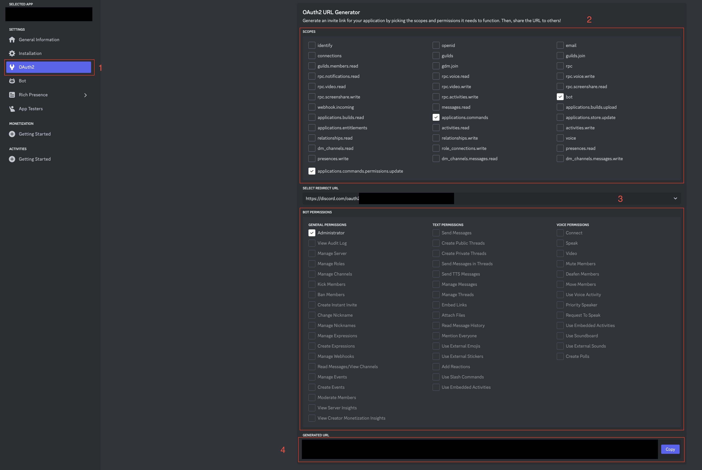
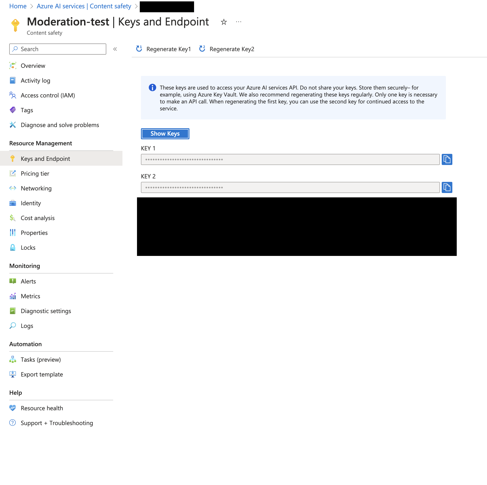

# Discord Moderation Bot

This repo contains code for a moderation bot that uses Azure Content Safety Studio to moderate messages against configurable thresholds.

## Getting started

### Prerequisites

#### Discord

In order for the bot to run it will require three channels to be created within the Discord server:

- logs: This channel will be used to log any instance of a violation detected within the server.
- alerts: This channel will be used to alert in the case of a chat spike within a channel in the server.
- reports: This channel will be used to post violation reports when requested.

A role named `Admin` will need to be created and added to any users that require the use of the commands offered by this bot.

#### Environment variables

Using the template provided created a new .env file within the root of the app folder (same location as the .env.sample). The following prerequisites will run you through where to find these variables.

#### Discord Bot

You will need to have created a bot on the [discord developer portal](https://discord.com/developers). While creating the bot make sure to copy the bot token as this will be needed to run the bot. Once created you will need to add this bot to your Discord server. This is done using the OAuth2 page seen on the left hand menu (1), This will gereate a URL that is used to add the bot to your server. Using the list of intents, select *bot*, *applications.commands* and *applications.commands.permissions.update* from the upper menu (2). In the lowwer selection box select *Administrator* as seen in the image below (3). You will then see a generate URL you can copy and paste into a new tab to add your bot to the server (4).



#### Azure Content Safety Studio

You will need to start by creating a Content Safety resource within Azure Portal, documentation to do this can be found [here](https://learn.microsoft.com/en-us/azure/ai-services/content-safety/studio-quickstart). Once created you will need 2 credentials to be able to run the bot. The first is the Content Safety endpoint, this will be `https://{resource name}.cognitiveservices.azure.com/`. The second is an access token, which can be found by navigating to the keys and endpoint section of the resource as seen in the image. Add both of these to your .env file



#### Mongo DB

Finally you will need to create a Mongo database in the cloud using Mongo's dasboard found [here](https://www.mongodb.com/). Once singed in create a new database and add the name of this to your .env file, This will be case sensitive. during the creation you will need to create a username and password, make sure this memorized. Do not worry about creating any tables as the code will do this automatically.

This bot uses a connection string to connect to the database, which can be generated by naviagting to the database -> clicking connect -> clicking drivers which will provide you with a connection url without a password. Copy the provided link into your .env file and replace `<password>` with the password you set when creating the database.

**Please note you will need to whitelist the IP addess of where the bot is being run**

### Running the bot locally

This README will cover running the bot locally. To get started you will need to create a Python Virtual Environment. This can be done by navigating to the app folder from the command line and running:

```bash
python3 -m venv venv
```

This creates the virtual environemtn and calls it venv. Next you will need to activate the virtual environment using:

```bash
source venv/bin/activate
```

Once activated you will need to install the required packages, this can be done using:

```bash
python3 install -r requirements.txt
```

Finally you will need to add your configuration to the config.txt, this is where you will set your thresholds for chat spikes and moderation. Once configured you will be able to run the bot using:

```bash
python3 main.py
```

### Commands

Commands are created using the Discords command tree. This means that all commands are run from within the server itself as slash commands. All commands require the Admin role in order to run, if Admin is not added a message stating missing privilages will be displayed.

- **Clear**: The clear command will clear 10 messages by default but a limit can be added as a parameter to the command to delete more or less if required.
- **Remove-slowdown**: in the case of a chat spike a message will be sent to the alerts channel, with the channel spiking being placed into a slowmode. This can be removed by using this command in the affected channel.
- **Generate-report**: This command can be run in any channel and will generate a violations report for all channels for a given month and year. This will be displayed in the reports channel.